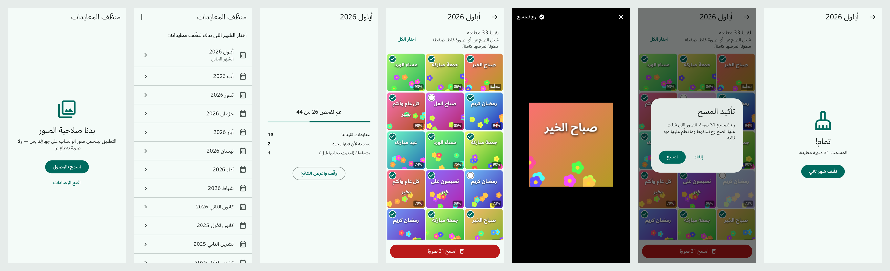

# منظّف المعايدات (Greeting Cleaner)

تطبيق أندرويد يلاقي صور المعايدات في ألبوم صور الواتساب (صباح الخير، جمعة
مباركة، تهنئات…) ويمسحها دفعة وحدة — مع حماية كاملة لأي صورة فيها وجه بشري.



<sub>لقطات من الواجهات الحقيقية ببيانات تجريبية — بتتولد بـ `tool/screenshots_test.dart`.</sub>

## كيف يشتغل

الفحص على الجهاز كله (من دون إنترنت)، بترتيب حاسم:

1. **فلترة الشهر** — استعلام MediaStore يجيب صور مجلدات WhatsApp Images للشهر المختار فقط.
2. **قائمة "ما تعلّم عليها"** — بصمة dHash لكل صورة تُقارن بلستة الصور اللي ما اخترتها سابقًا → تتجاهل فورًا.
3. **كشف الوجوه (ML Kit)** — أي صورة فيها وجه **محمية دايمًا**، حتى لو كانت معايدة.
4. **قائمة "المحذوفات"** — صورة قريبة من صورة معايدة مسحتها قبل → تُعلّم مباشرة (بدون مودل).
5. **المصنّف (TFLite)** — إذا معدّ النقاط السابقة، المودل يقيّم احتمال أنها معايدة؛ فوق العتبة (0.7) → تظهر في النتائج.

بتقدر تعرض أي صورة بالحجم الكامل (ضغطة مطوّلة)، وتشيل الصح عن أي نتيجة
غلط — التطبيق بيتعلم من الاختيار وبيخزن بصمات القرارات بـ SQLite.

## المتطلبات

- Flutter 3.44 (stable)
- جهاز/محاكي أندرويد
- ملف المودل: `assets/models/greeting_classifier.tflite` — **مش موجود في
  المستودع** (حجمه كبير). تدريبه مشروح بالكامل في
  [`training/README.md`](training/README.md):
  ```bash
  cd training
  python -m venv .venv && .venv\Scripts\activate
  pip install -r requirements.txt
  python build_normal.py          # تجهيز كلاس الصور العادية (COCO)
  python train.py --data dataset --epochs 30
  python export.py                # يكتب assets/models/ تلقائياً
  ```
  بدون مودل، التطبيق بيشتغل بس بوضع "التعلم من المحذوفات" (خطوتا 2 و4).

## التشغيل

```bash
flutter pub get
flutter run            # على جهاز أندرويد
flutter build apk      # APK للنشر
```

## البنية

```
lib/
  main.dart                 تهيئة الخدمات وتشغيل التطبيق (عربي، RTL)
  config.dart               كل الثوابت القابلة للضبط (عتبات، مسارات…)
  screens/home_screen.dart  الشاشة الوحيدة، بتنقل حسب الحالة
  state/cleaner_controller.dart  حالات التطبيق كلها (Provider)
  services/
    gallery_service.dart    الوصول للصور عبر photo_manager + المسح والحذف
    face_detector_service.dart  حماية الوجوه (ML Kit)
    image_hash.dart + hash_store.dart  بصمات dHash وذاكرة القرارات (sqflite)
    scan_pipeline.dart      ترتيب الفحص (اللي فوق)
    classifier/             تشغيل مودل TFLite بخيط خلفي معزول
  widgets/                  شبكة النتائج، عارض الصور الكاملة، منتقي الشهور…
test/                       اختبارات البصمة، الذاكرة، ترتيب الفحص، المودل، الواجهة
training/                   سكربتات تدريب المودل وتصديره
```

ملاحظات:
- الحذف على أندرويد 11+ بيودّي الصور على **سلة المهملات** (قابلة للاسترجاع
  30 يوم)، والنظام بيطلب تأكيد واحد للدفعة كلها.
- لما تمسح، الصور اللي انمسحت بتنحفظ بصمتها كـ "محذوفة"، واللي شلت عنها
  الصح بتنحفظ كـ "ما تعلّم عليها". بتقدر تمسح ذاكرة التعلّم من القائمة فوق.
- إذا كشف الوجه فشل لأي سبب، الصورة بتنعدّ محمية (الأسلم).

الاختبارات: `flutter test`
